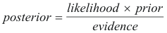

Consider the following quote from a 2000 article in the Economist on the Bayesian Approach:

*"The essence of the Bayesian approach is to provide a mathematical rule explaining how you should change your existing beliefs in the light of new evidence. In other words, it allows us to combine new data with their existing knowledge or expertise. The canonical example is to imagine that a precocious newborn observes his first sunset, and wonders whether the sun will rise again or not. He assigns equal prior probabilities to both possible outcomes, and represents this by placing one white and one black marble into a bag. The following day, when the sun rises, the child places another white marble in the bag. The probability that a marble plucked randomly from the bag will be white (i.e., the child's degree of belief in future sunrises) has thus gone from a half to two-thirds. After sunrise the next day, the child adds another white marble, and the probability (and thus the degree of belief) goes from two-thirds to three-quarters. And so on. Gradually, the initial belief that the sun is just as likely as not to rise each morning is modified to become a near-certainty that the sun will always rise."*

In terms of classification, the Bayes theorem allows us to combine prior probabilities, along with observed evidence to arrive at the posterior probability. More or less, conditional probabilities represent the probability of an event occurring given evidence. To better understand, Bayes Theorem can be derived from the joint probability of A and B (i.e. P(A,B)) as follows:

where *P(A|B)* is referred to as the posterior; *P(B|A)* is known as the likelihood, *P(A)* is the prior and *P(B)* is generally the evidence and is used as a scaling factor. Therefore, it is handy to remember Bayes Rule as:

These terms will be discussed a little later.
